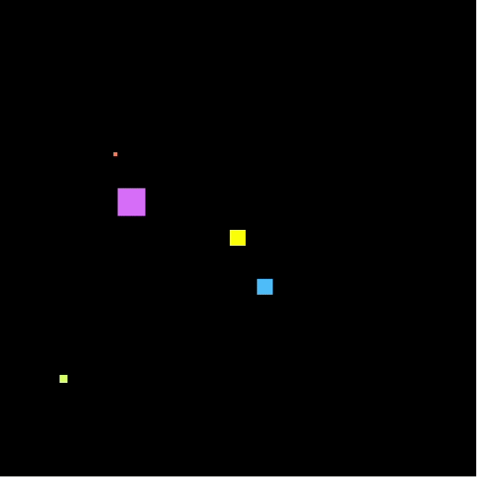

# orbit_js
A little math example in js to create an orbit.

you can test it online [basics](https://js.do/code/439943) [advanced](https://js.do/code/440011)

# Gif! 👀
Basics (index.html)

Applied basics (adv_index.html)

